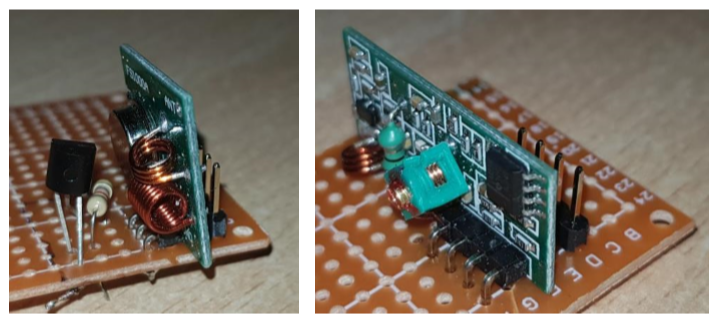
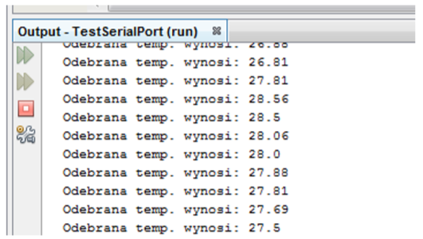
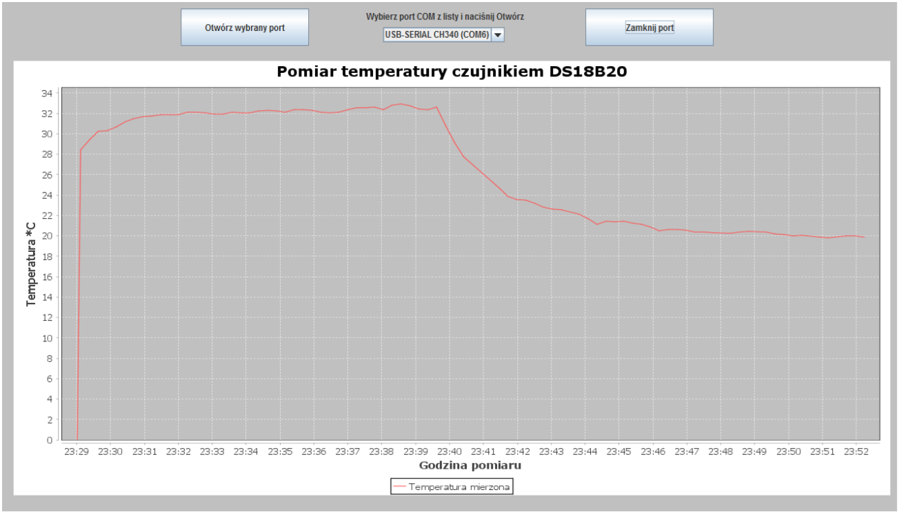

# Remotely temperature measurement device 

Project: Remotely temperature measurement device 

## Project description

This project concernes creating a wireless temperature measuring system and implementation of cooperating PC software. Project had two stages - first was design and choose electronic components and second one was programming. Measurement system was build with Arduino platform and software was implemented in Java. The wireless connection was obtained by radio transmitter and receiver. This kind of deviece gave an opportuinity to wireless real time monitoring of temperatures in choosen locations.

## Hardware 

The image below shows complete hardware circuits (measurement and transmission part on left and reciver part on right side of picture).

## Software

Implemented software allowed for store temperature data and visualise it on chart. Date recived by "reciver part" were sent to COM Port by USB cable, and then application store it, and show on GUI. 

First step of application user was to choose a COM Port from list and try to Open Port. If everything went well, some data were spotted on chart and displayed in console (picture below shows console). 

Main application window (GUI) was presented below. It shows a temperature fluctuations in time.

If you want to learn more, contact me on github @MarcinJ7.
